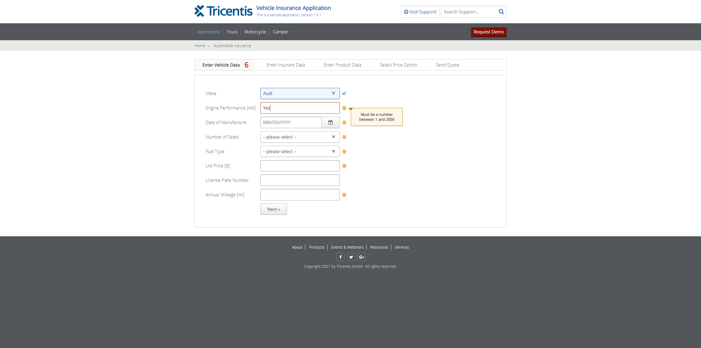

# Insurance App Automation Test

Automated test suite for insurance application using Selenium WebDriver (C#) with Page Object Model pattern.

## Features
- Page Object Model implementation
- Field validations for mandatory inputs
- Screenshot evidence capture
- Cross-browser compatibility (Chrome)

## Prerequisites
- [.NET 8 SDK](https://dotnet.microsoft.com/download/dotnet/8.0)
- Chrome browser (latest version)
- Git

## Setup
1. Clone repository:
```bash
git clone https://github.com/Chrisdbhr/Test-InsuranceAppAutomation.git
```
2. Restore packages and run tests:
```bash
dotnet restore
dotnet test
```
## Test Evidence Screenshots

| Screenshot | Description |
|------------|-------------|
|  | **Validation Errors**: Error messages shown when filling wrong data in field. |
|  | **Valid Data Filled**: Form with valid data filled. |

## Key Components
- **Page Objects**: Contains element locators and page interactions
- **BasePage**: Shared screenshot functionality
- **NUnit**: Test framework
- **WebDriverManager**: Automatic browser driver management
